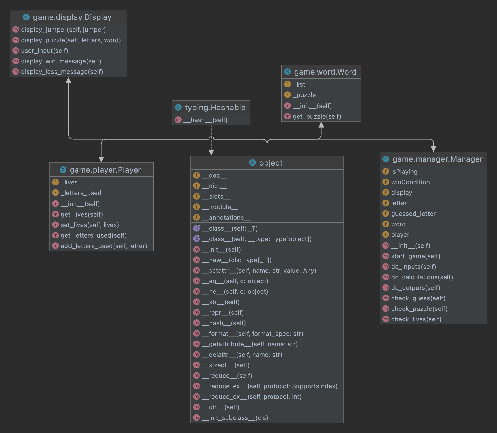

# Jumper

Jumper is a game in which the player seeks to solve a puzzle by guessing the letters of a secret word one at a time.

## Game requirements

---

Jumper is played accotding to the following rules.

The player starts the game with a parachute. In the game we will have a puzzle, the puzzle will be a secret word randomly chosen from a list, each turn the player will write a letter and try to guess one of the secret word's letter, if the guess is correct, the letter is reevaled! but if not... a line is cut on the player's parachute or in other words the player lose a live. The game is over if the player solved the puzzle or if the player has no more his parachute.

## Getting Started

---

Make sure you have Python 3.8.0 or newer installed and running on your machine. Open a terminal and
browse to the project's root folder. Start the program by running the following command.

```
python3 hilo
```

You can also run the program from an IDE like Visual Studio Code. Start your IDE and open the
project folder. Select the main module inside the dice folder and click the "run" button.

## Project Structure

---

The project files and folders are organized as follows:

```
root                    (project root folder)
+-- jumper                (source code for game)
  +-- game              (specific classes)
  +-- __main__.py       (program entry point)
+-- README.md           (general info)
```

## Required Technologies

---

- Python 3.8.0

## UML Diagram



---

## Define of classes:

---

Player
- lives:[chart]
- letter that used:[strings]
- +writeALetter():string
- +getLives():[chart]
 

Game Manager
- +startGame():void
- +getInput():string
- +displayOutput():void
- +doMatch():void
- +endGame():void

Display
- +output():void
- +input():string

Word generator
- -list of words
- +generateRandomlyWord():string

## Authors

---

- Diego Feresin (diegoferesin@gmail.com)
- Emma Lund (lun21010@byui.edu)
- Nestor Rivera (riv21007@byui.edu)
- Juan Castellani (cas22009@byui.edu)
- Kennette Guevara (rod21023@byui.edu)
